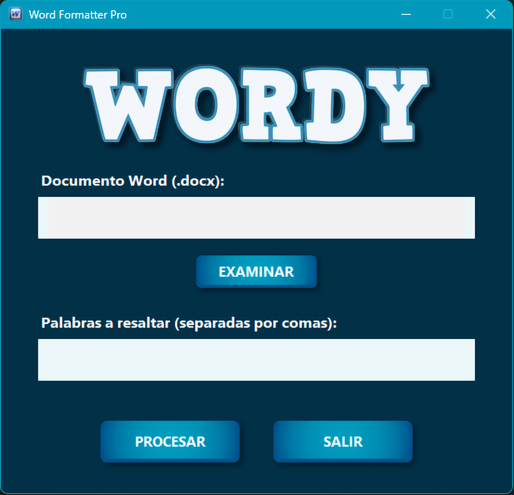

# 🔍 MetaData (Windows) — Advanced Metadata Forensic & Extraction Tool

Herramienta Avanzada de Análisis Forense y Extracción de Metadatos en Imágenes

**MetaData** es una potente herramienta forense de escritorio desarrollada en **Python 3.11+** diseñada para el análisis técnico profundo, inspección estructural, verificación de integridad y sanitización controlada de metadatos en archivos de imagen.

La aplicación está orientada a:

* Investigadores digitales
* Analistas técnicos
* Fotógrafos profesionales
* Usuarios preocupados por la privacidad
* Todo el procesamiento se realiza 100% de forma local, sin servicios en la nube ni transmisión de datos externos.

---

## 📷 Formatos Soportados

MetaData está optimizado para el análisis de los formatos de imagen más utilizados en entornos profesionales y forenses:

*   🖼️ **JPEG / JPG:** Soporte completo (EXIF, XMP, IPTC, Adobe IRB).
*   🖼️ **PNG:** Extracción de metadatos estándar y bloques de texto.
*   🖼️ **TIFF / TIF:** Análisis de etiquetas EXIF y metadatos de alta resolución.

---

---

## 🏗️ Ingeniería y Arquitectura

MetaData sigue un patrón estructurado **MVC (Modelo-Vista-Controlador)** que garantiza separación de responsabilidades y mantenibilidad.

🔹 **Capa de Negocio (Core)**

Módulos especializados para:
    * Extracción completa de metadatos EXIF
    * Análisis y lectura de XMP
    * Inspección binaria de cabeceras
    * Análisis estructural de marcadores JPEG (APP0, APP1, APP13, etc.)
    * Generación de hashes criptográficos (MD5, SHA-256)
    * Validación de consistencia temporal y estructural

🔹 **Capa de Interfaz (UI)**

    * Interfaz nativa para Windows
    * Soporte High-DPI (4K Ready)
    * Sistema Drag & Drop
    * Gestión eficiente de recursos

🔹 **Gestión de Recursos**

    * Bundling interno optimizado
    * Sistema de caché LRU
    * Ejecutables firmados digitalmente

---

## 🧪 Capacidades Forenses

1️⃣ Extracción y Análisis de Metadatos

    * Inspección completa de etiquetas EXIF
    * Lectura y análisis de bloques XMP
    * Detección de Adobe IRB (APP13)
    * Inspección de segmentos JPEG
    * Escaneo de firmas binarias de software de edición

2️⃣ Validación de Consistencia

    Detección heurística de:

    * Discrepancias entre DateTimeOriginal y ModifyDate
    * Rastros de software de edición
    * Anomalías estructurales en bloques de metadatos
    * Presencia de miniaturas embebidas
    * Extracción y validación de coordenadas GPS

⚠️ La herramienta reporta indicadores técnicos e inconsistencias estructurales. No emite conclusiones legales.

3️⃣ Integridad y Soporte de Cadena de Custodia

Generación automática de huellas digitales al cargar cualquier archivo:

    * MD5
    * SHA-256
    * Permite verificar integridad antes y después del análisis.

4️⃣ Motor de Sanitización (Privacidad)

Eliminación selectiva de:

    * Coordenadas GPS
    * Campos de autor
    * Identificadores de dispositivo
    * Rastros de software

La sanitización se ejecuta localmente sin conexión externa.             

---
---

## 📷 Capturas de Pantalla

  

--- 

## 🚀 Guía de Instalación y Uso

MetaData se distribuye en dos formatos profesionales diseñados para diferentes necesidades:

### 1. Versión Portable (Análisis en Campo) 🏃
**Sin instalación.** Ideal para técnicos forenses que requieren movilidad y uso desde memorias USB en cualquier equipo.
1.  Ve a la sección [**Releases**](https://github.com/Pablitus666/Meta-Data/releases).
2.  Descarga el archivo `MetaData_Portable.exe`.
3.  **Ejecución:** Simplemente haz doble clic. Al ser un ejecutable único comprimido, tardará unos segundos en cargar los recursos; esto es normal y garantiza la portabilidad total sin dejar rastro en el sistema.

### 2. Versión Instalable (Estación de Trabajo) 🖥️
**Experiencia completa.** Recomendada para estaciones de trabajo permanentes.
1.  Descarga `MetaData_Setup.exe` desde [**Releases**](https://github.com/Pablitus666/Meta-Data/releases).
2.  Ejecuta el instalador firmado digitalmente.
3.  **Ventajas:** Arranque instantáneo, integración con Windows y accesos directos con **iconos Full HD (256x256)**.
4.  Construida con **PyInstaller** e **Inno Setup**

---

## ✨ Características Destacadas

*   🌍 **Soporte multilenguaje 9 Idiomas:** ES, EN, FR, DE, IT, PT, RU, JA, ZH con detección automática.
*   🖱️ **Drag & Drop nativo:** Sistema intuitivo de arrastrar y soltar archivos.
*   🛡️ **Firma Digital Verificada:** Todo el software está firmado Digitalmente.
*   📓 **Logs Seguros:** Registros almacenados automáticamente en `%LOCALAPPDATA%\MetaData`.
*   📍 **GPS Integrado:** Enlace directo a Google Maps desde coordenadas extraídas.
*   🧱 Arquitectura modular orientada a análisis forense

---

🧰 Stack Tecnológico

    🔹 Python 3.11+
    🔹 exifread
    🔹 piexif
    🔹 hashlib
    🔹 PyInstaller
    🔹 Inno Setup

---

## 🧭 Evolución: Versión Legacy

MetaData representa la evolución profesional de un script experimental previo. La versión Legacy permanece disponible con fines educativos.
👉 [**MetaData — Legacy Edition**](https://github.com/Pablitus666/Meta-Data---Legacy.git)

---
📜 Aviso Legal

MetaData es una herramienta de asistencia técnica para análisis estructural y revisión de metadatos con fines educativos y profesionales.

Proporciona indicadores basados en metadatos y análisis binario, pero no sustituye peritajes realizados en laboratorios forenses certificados.

---

## 👨‍💻 Autor

**Walter Pablo Téllez Ayala**  
Software Developer  
📍 Bolivia 🇧🇴  
📧 [pharmakoz@gmail.com](mailto:pharmakoz@gmail.com) 

© 2026 — MetaData Forensic Tool

---

⭐ Si este proyecto te es útil, considera dejar una estrella en el repositorio oficial: [**MetaData Repo**](https://github.com/Pablitus666/Meta-Data.git)
